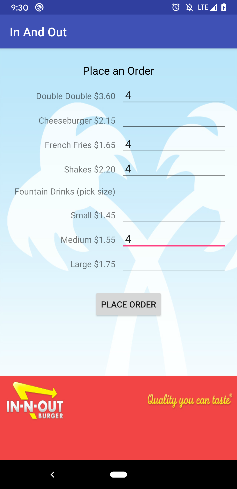
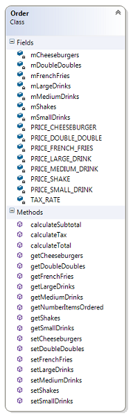

# InAndOut
Android app using multiple Activities and Intent

## Screenshot
<table>
  <thead>
    <tr><th align="center"> <strong>Order Activity</strong> </th>
        <th align="center"> <strong>Summary Activity</strong> </th>
    </tr>
  </thead>
  <tbody>
    <tr><td align="center">
            
        </td>
        <td align="center">
            
        </td>
    </tr>
  </tbody>
</table>

## Instructions
As our first project using multiple Activities and Intents, we will be implementing  
an app to place orders at the fictional "In And Out Burger"  (actual company is  
named In-N-Out)

**Order Activity shown below (activity_order.xml)**

We will be utilizing a TableLayout to group all of the Views presented in the  
OrderActivity together.

When the user clicks the placeOrderButton, all the input from each control should  
be read and set within the model (Order.java).  
An Intent will be created that sends the necessary information to a second activity  
called SummaryActivity.  Below is a sample transaction showing the flow of  
information from OrderActivity to SummaryActivity:

 &emsp;

**Order.java model class diagram**

**Tasks to Accomplish in the OrderActivity.java Controller:**
1. Add an onClick event for the placeOrderButton which reads each of the EditText  
   controls and initializes an Order model with the user input.
2. Create the Intent object needed to pass information to the SummaryActivity.
3. Start the SummaryActivity

**Tasks to Accomplish in the SummaryActivity.java Controller:**
1. In the onCreate method, read the data from the Intent and populate the  
   corresponding TextViews.
2. Add an onClick event for the startNewOrderButton that finishes the  
   SummaryActivity.

